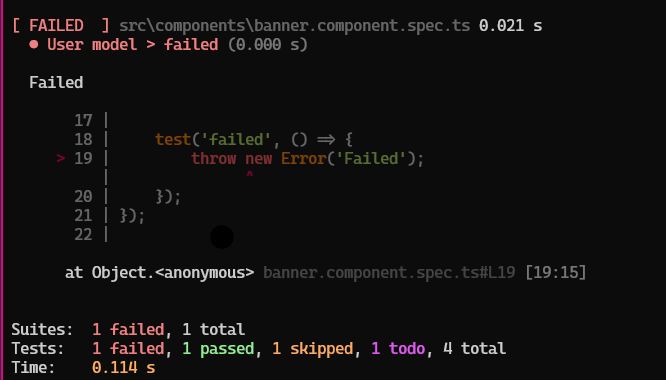
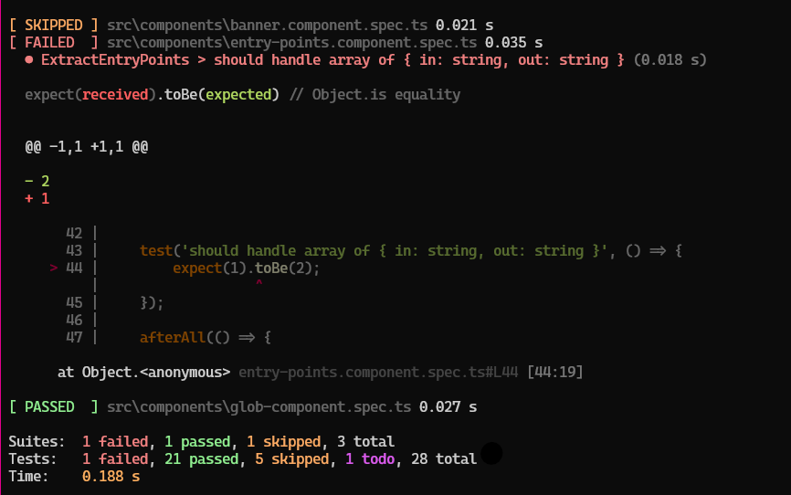
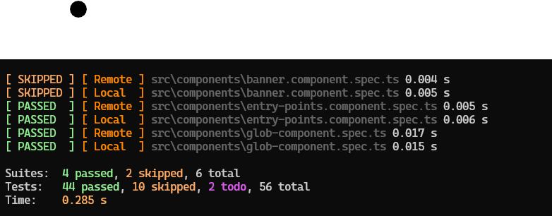

# xJet

[](https://remotex-labs.github.io/xJet/)
[](https://www.npmjs.com/package/@remotex-labs/xjet)
[](https://opensource.org/licenses/MPL-2.0)
[](https://github.com/remotex-labs/xJet/actions/workflows/node.js.yml)

## Overview

xJet is a powerful, flexible testing framework for JavaScript and TypeScript applications. 
Its mission is to help you "Run Automated Tests Anywhere, Effortlessly".

## Features

- **Familiar API**: Uses a Jest-like interface with `describe`, `it`, `test`, and `expect` functions
- **Powerful Mocking**: Complete suite of mocking utilities including `fn`, `mock`, and `spyOn`
- **CLI Options**: Configurable through command-line arguments
- **Multiple Reporters**: Support for different output formats including human-readable, JSON, and JUnit XML
- **TypeScript Support**: First-class TypeScript support with type definitions included

## Installation

```bash
npm install @remotex-labs/xjet
```

## Usage

### Basic Test Example

```ts
// example.test.ts 
describe('Calculator', () => { test('should add two numbers correctly', () => { 
    const result = 1 + 2; expect(result).toBe(3); 
});

it('should subtract two numbers correctly', () => { 
    const result = 5 - 2; expect(result).toBe(3); }); 
});
```

### Running Tests

```bash
xJet
```

Run:








## Documentation
For complete API documentation, examples, and guides, visit: [xAnsi Documentation](https://remotex-labs.github.io/xAnsi/)

## Compatibility
- Node.js 20+
- All modern browsers (via bundlers)
- TypeScript 4.5+

## Contributing
Contributions are welcome!\
Please see our [Contributing Guide](CONTRIBUTING.md) for details.

## License
This project is licensed under the Mozilla Public License 2.0 see the [LICENSE](LICENSE) file for details.

## Acknowledgments
- Built with TypeScript
