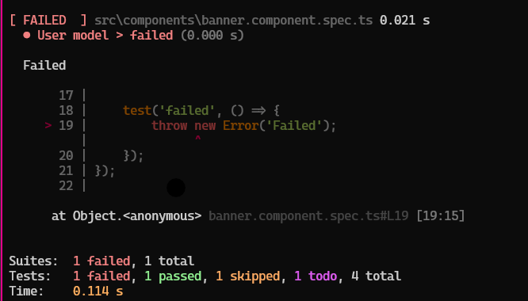
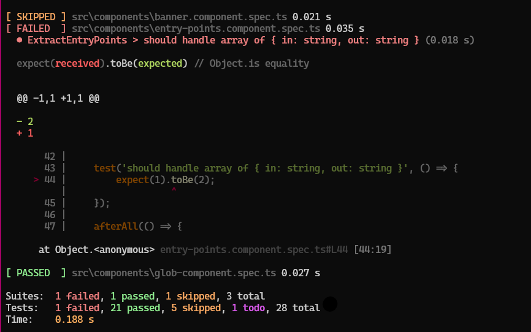
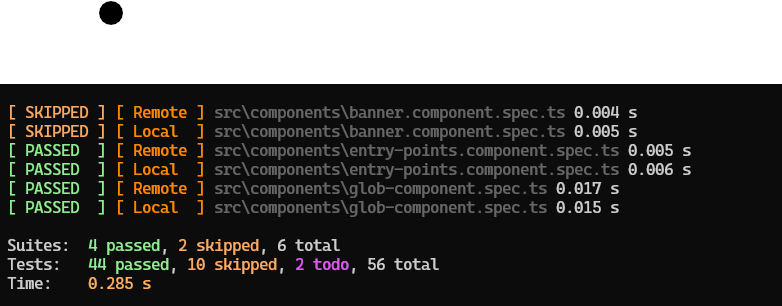

# xJet

[](https://remotex-labs.github.io/xJet/)
[](https://www.npmjs.com/package/@remotex-labs/xjet)
[](https://www.npmjs.com/package/@remotex-labs/xjet)
[](https://opensource.org/licenses/MPL-2.0)
[](https://github.com/remotex-labs/xJet/actions/workflows/ci.yml)
[](https://discord.gg/BnEUkXJC)
[](https://deepwiki.com/remotex-labs/xJet)

A powerful, flexible testing framework for JavaScript and TypeScript applications. Its mission is to help you
"Run Automated Tests Anywhere, Effortlessly."

It provides a Jest-like API with `describe`, `it`, `test`, and `expect`, a complete suite of mocking utilities,
configurable CLI options, and multiple output reporters, all with first-class TypeScript support.

## Key Features

- **Familiar API**: a Jest-like interface with `describe`, `it`, `test`, and `expect` functions.
- **Powerful mocking**: a complete suite of mocking utilities including `fn`, `mock`, and `spyOn`.
- **CLI options**: configurable through command-line arguments.
- **Multiple reporters**: support for different output formats including human-readable, JSON, and JUnit XML.
- **TypeScript support**: first-class TypeScript support with type definitions included.

## Installation

```bash
npm install @remotex-labs/xjet
# or
pnpm add @remotex-labs/xjet
# or
yarn add @remotex-labs/xjet
```

xJet requires Node.js 20 or later.

## Quick start

Create a test file and start writing tests immediately:

```ts
// example.test.ts
describe('Calculator', () => {
    test('should add two numbers correctly', () => {
        const result = 1 + 2;
        expect(result).toBe(3);
    });

    it('should subtract two numbers correctly', () => {
        const result = 5 - 2;
        expect(result).toBe(3);
    });
});
```

Running the suite:







## Compatibility

- Node.js 20 or later
- All modern browsers (via bundlers)
- TypeScript 4.5 or later

## Documentation

Full guides and the complete API reference live at
**[remotex-labs.github.io/xJet](https://remotex-labs.github.io/xJet/)**:

- [CLI Options](https://remotex-labs.github.io/xJet/configuration/cli)
- [Test Structure](https://remotex-labs.github.io/xJet/tests/test)
- [Mocking APIs](https://remotex-labs.github.io/xJet/mocks/mock)
- [Timer Manipulation](https://remotex-labs.github.io/xJet/mocks/timer)
- [Matchers Reference](https://remotex-labs.github.io/xJet/xjet-expect/equality)

## Contributing

Contributions are welcome!\
Please see our [Contributing Guide](CONTRIBUTING.md) for details.

## Links

[Documentation](https://remotex-labs.github.io/xJet/), [GitHub Repository](https://github.com/remotex-labs/xJet), [Issue Tracker](https://github.com/remotex-labs/xJet/issues), [npm Package](https://www.npmjs.com/package/@remotex-labs/xjet)

## License

This project is licensed under the Mozilla Public License 2.0 - see the [LICENSE](LICENSE) file for details.
